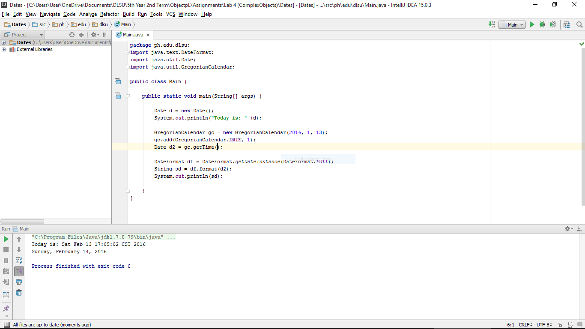

#Dates

Getting and Adding of days.

#ScreenShot

#Code

~~~
package ph.edu.dlsu;
import java.text.DateFormat;
import java.util.Date;
import java.util.GregorianCalendar;

public class Main {

    public static void main(String[] args) {

        Date d = new Date();
        System.out.println("Today is: " +d);

        GregorianCalendar gc = new GregorianCalendar(2016, 1, 13);
        gc.add(GregorianCalendar.DATE, 1);
        Date d2 = gc.getTime();

        DateFormat df = DateFormat.getDateInstance(DateFormat.FULL);
        String sd = df.format(d2);
        System.out.println(sd);

    }
}
~~~
